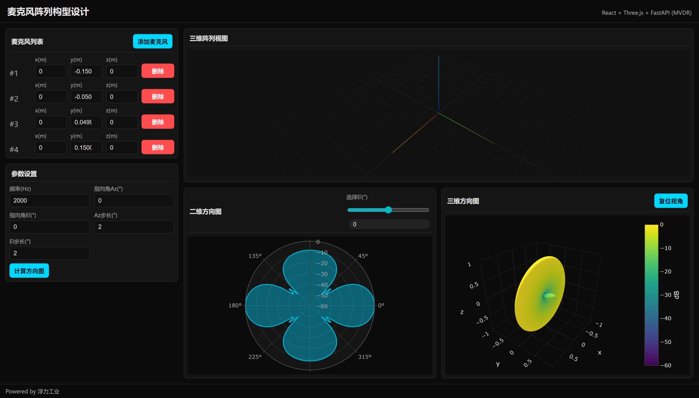

# 麦克风阵列构型设计网站

## 项目简介
本项目为麦克风阵列构型设计与仿真平台，支持阵列三维交互编辑、三维可视化、MVDR 波束形成仿真，并以二维极坐标图和三维方向图展示结果。前端采用 React 与 Three.js，后端采用 FastAPI，全部本地部署，无需用户数据存储。

## 技术栈
- 前端：React + TypeScript + Three.js + Plotly.js
- 后端：Python + FastAPI
- 波束形成算法：MVDR (Minimum Variance Distortionless Response)
- 部署环境：NodeJS 18+，Python 3.11+

## 主要功能
- 阵列麦克风三维坐标增删改，支持拖拽与表单编辑
- 阵列三维可视化（Three.js）
- MVDR 波束形成仿真（后端计算）
- 方向图展示：二维、三维方向图
- 极坐标/三维方向图模块高度一致
- 左侧面板支持内部滚动
- 方向图模块支持“复位视角”

## 目录结构（详细说明）

```
arrayDesigner/
│
├─ README.md                # 项目说明文档
│
├─ backend/                 # 后端（Python, FastAPI）
│  ├─ requirements.txt      # 后端依赖列表
│  ├─ selftest_httpx.py     # 后端自检脚本
│  ├─ test_backend.py       # 后端测试脚本
│  └─ app/                  # FastAPI 应用主目录
│     ├─ __init__.py        # 包初始化文件
│     ├─ main.py            # FastAPI 主入口
│     └─ mvdr.py            # MVDR 波束形成算法实现
│
├─ frontend/                # 前端（React, TypeScript, Three.js, Plotly）
│  ├─ index.html            # 前端入口 HTML
│  ├─ package.json          # 前端依赖及脚本
│  ├─ package-lock.json     # 前端依赖锁定文件
│  ├─ tsconfig.json         # TypeScript 配置
│  ├─ vite.config.ts        # Vite 配置
│  ├─ dist/                 # 前端构建输出目录
│  └─ src/                  # 前端源码
│     ├─ api.ts             # 与后端 API 交互
│     ├─ App.tsx            # React 主组件
│     ├─ main.tsx           # 前端入口文件
│     ├─ plotly.tsx         # Plotly 图表相关
│     ├─ styles.css         # 全局样式
│     ├─ three-examples.d.ts# Three.js 类型声明
│     ├─ types.ts           # 类型定义
│     ├─ typings.d.ts       # 额外类型声明
│     └─ components/        # 组件目录
│        ├─ Array3DView.tsx     # 阵列三维可视化组件
│        ├─ MicEditor.tsx       # 麦克风编辑组件
│        ├─ PolarPlot.tsx       # 二维方向图组件
│        └─ Surface3DPlot.tsx   # 三维方向图组件
```

## 安装与运行

### 后端
1. 安装依赖：
   ```cmd
   cd backend
   pip install -r requirements.txt
   ```
2. 启动服务：
   ```cmd
   python -m uvicorn app.main:app --host 127.0.0.1 --port 8000
   ```
3. 健康检查：
   ```cmd
   curl http://127.0.0.1:8000/api/health
   ```

### 前端
1. 安装依赖：
   ```cmd
   cd frontend
   npm install
   ```
2. 设置后端（可选）：
   ```cmd
   set VITE_API_BASE_URL=http://127.0.0.1:8000
   ```
3. 编译前端：
   ```cmd
   npm run build --slient
   ```
4. 启动前端：
   ```cmd
   npm run preview
   ```
5. 浏览器访问：
   http://127.0.0.1:5173

## 使用说明
- 在左侧面板增删改麦克风坐标，支持滚动

- 右侧实时显示阵列三维视图

- 设置参数后点击仿真，显示二维和三维方向图

- 方向图模块可复位视角

  


## 常见问题
- 如遇端口占用，请修改启动命令中的端口号
- 后端需保持运行，前端才能正常访问仿真功能
